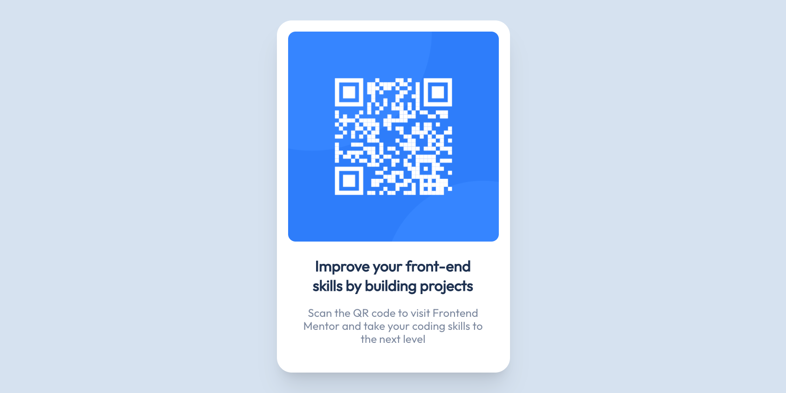

# Frontend Mentor - QR code component solution

This is a solution to the [QR code component challenge on Frontend Mentor](https://www.frontendmentor.io/challenges/qr-code-component-iux_sIO_H). Frontend Mentor challenges help you improve your coding skills by building realistic projects.

## Table of contents

- [Frontend Mentor - QR code component solution](#frontend-mentor---qr-code-component-solution)
  - [Table of contents](#table-of-contents)
  - [Overview](#overview)
    - [Screenshot](#screenshot)
    - [Links](#links)
  - [My process](#my-process)
    - [Built with](#built-with)
    - [What I learned](#what-i-learned)
    - [Useful resources](#useful-resources)
  - [Author](#author)

## Overview

### Screenshot

### Links

- Solution URL: [https://github.com/xup3/qr-code-component](https://github.com/xup3/qr-code-component)
- Live Site URL: [https://naughty-blackwell-cd4510.netlify.app](https://naughty-blackwell-cd4510.netlify.app/)

## My process

### Built with

- Semantic HTML5 markup
- CSS custom properties
- Flexbox
- Mobile-first workflow
- [Vue.js](https://vuejs.org/) - JS library

### What I learned

Just getting started on this platform, so I'm getting used to describe what I've learned. Not sure if it's any at all with this, but I just wanna start with newbiew challenges to see where I stand right now.

### Useful resources

- [Vite Static Asset Handling](https://vitejs.dev/guide/assets.html) - This helped me with loading static images and cache them

## Author

- Frontend Mentor - [@xup3](https://www.frontendmentor.io/profile/xup3)
- Twitter - [@jrdevforlife](https://twitter.com/jrdevforlife)
